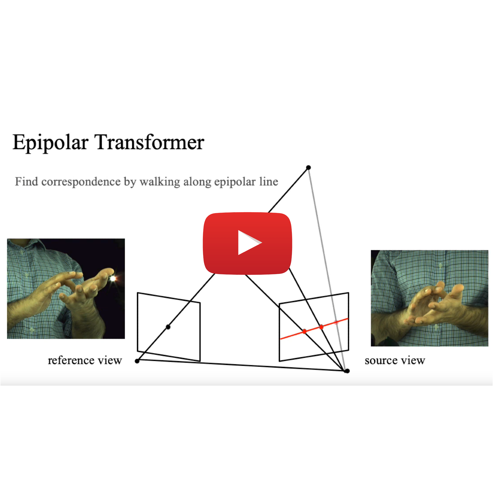
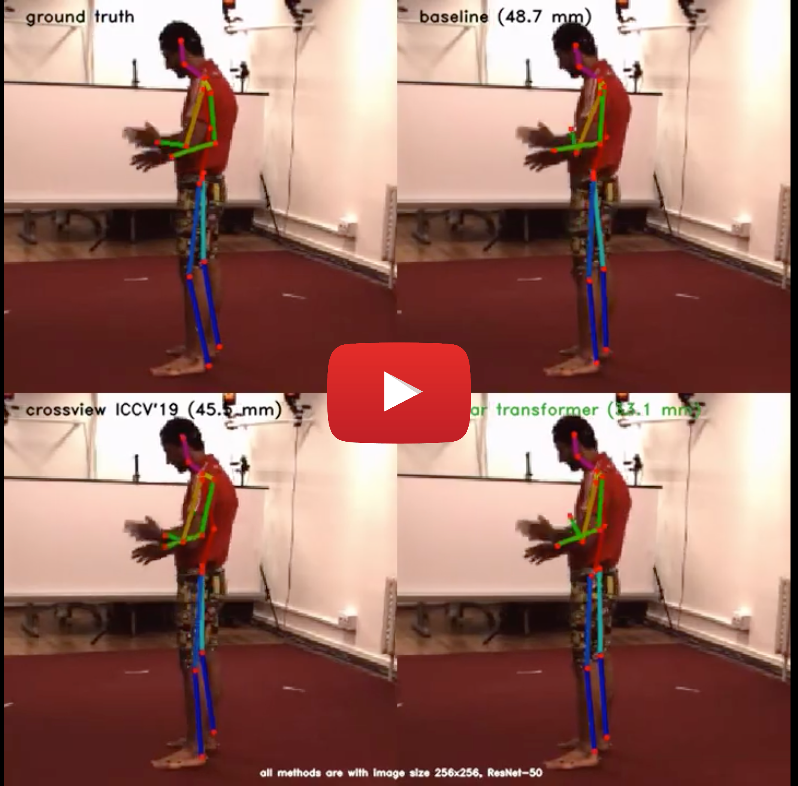
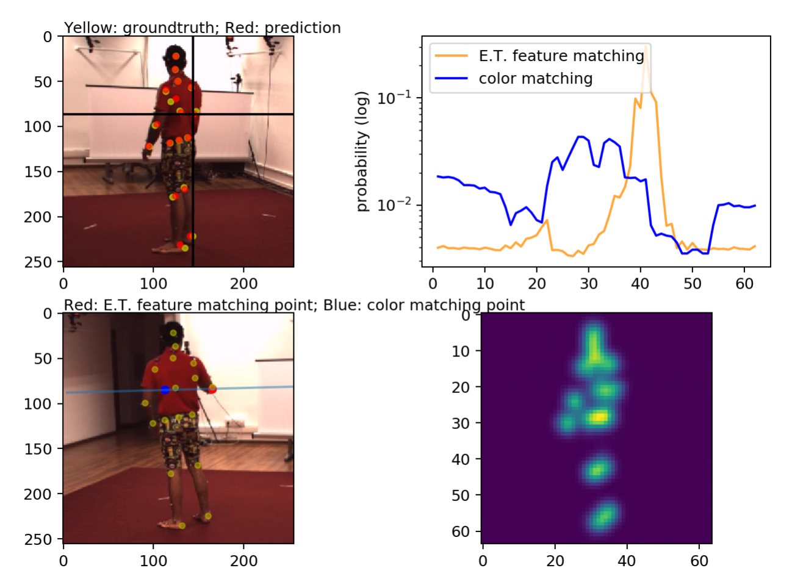
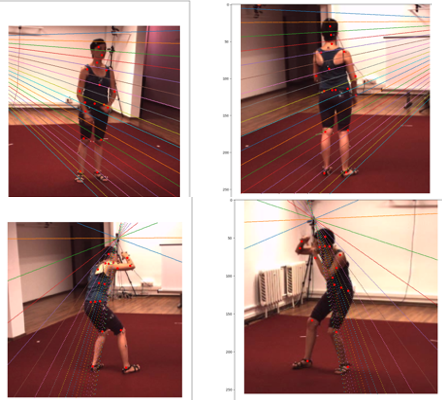

# [Epipolar Transformers](https://arxiv.org/abs/2005.04551) [](https://paperswithcode.com/sota/3d-human-pose-estimation-on-human36m?p=epipolar-transformers)

[Yihui He](http://yihui-he.github.io/), [Rui Yan](https://github.com/Yre), [Katerina Fragkiadaki](https://www.cs.cmu.edu/~katef/), [Shoou-I Yu](https://sites.google.com/view/shoou-i-yu/home) (Carnegie Mellon University, Facebook Reality Labs)

**CVPR 2020**, **[CVPR workshop Best Paper Award](https://vuhcs.github.io/)**


Oral presentation and human pose demo videos ([playlist](https://www.youtube.com/playlist?list=PLkz610aVEqV-f4Ws0pH0e8Nm_2wTGI1yP)):
<p align="center">
  <a href="https://www.youtube.com/watch?v=nfb0kfVWjcs">
    
  </a>
  <a href="https://www.youtube.com/watch?v=ig5c-qTaYkg">
    
  </a>
</p>

## Models

config | MPJPE (mm) | model & log
:-------------------------:|:-------------------------:|:-------------------------
[ResNet-50 256×256, triangulate](configs/benchmark/keypoint_h36m.yaml) | 45.3          |  [download](https://github.com/yihui-he/epipolar-transformers/releases/download/outputs/outs.benchmark.keypoint_h36m_afterfix.zip)
[ResNet-50 256×256, triangulate, epipolar transformer](configs/epipolar/keypoint_h36m_zresidual_fixed.yaml) | 33.1          |  [download](https://github.com/yihui-he/epipolar-transformers/releases/download/outputs/outs.epipolar.keypoint_h36m_fixed.zip)
[ResNet-50 256×256, triangulate, epipolar transformer (augmentation)](configs/epipolar/keypoint_h36m_zresidual_aug.yaml) | 30.4         |  [download](https://github.com/yihui-he/epipolar-transformers/releases/download/outputs/outs.epipolar.keypoint_h36m_fixed_aug.zip)
[ResNet-152 384×384, triangulate, epipolar transformer (extra data)](configs/epipolar/keypoint_h36m_resnet152_384_pretrained_8gpu.yaml) | 19.0         | 

We also provide 2D to 3D lifting network implementations for these two papers:
- [3D Hand Shape and Pose from Images in the Wild](https://arxiv.org/abs/1902.03451), CVPR 2019
  - `configs/lifting/img_lifting_rot_h36m.yaml` (Human 3.6M)
  - `configs/lifting/img_lifting_rot.yaml` (RHD)
- [Learning to Estimate 3D Hand Pose from Single RGB Images](http://openaccess.thecvf.com/content_ICCV_2017/papers/Zimmermann_Learning_to_Estimate_ICCV_2017_paper.pdf), ICCV 2017
  - `configs/lifting/lifting_direct_h36m.yaml` (Human 3.6M)
  - `configs/lifting/lifting_direct.yaml` (RHD)

## Setup

### Requirements
Python 3, pytorch > 1.2+ and pytorch < 1.4
```bash
pip install -r requirements.txt
conda install pytorch cudatoolkit=10.0 -c pytorch
```
### Pretrained weights download
```bash
mkdir outs
cd datasets/
bash get_pretrained_models.sh
```

Please follow the instructions in `datasets/README.md` for preparing the dataset

### Training
```bash
python main.py --cfg path/to/config
tensorboard --logdir outs/
```

### Testing 
Testing with latest checkpoints
```bash
python main.py --cfg configs/xxx.yaml DOTRAIN False
```
Testing with weights
```bash
python main.py --cfg configs/xxx.yaml DOTRAIN False WEIGHTS xxx.pth
```

## Visualization
### Epipolar Transformers Visualization 

    
- Download the [output pkls ](https://github.com/yihui-he/epipolar-transformers/releases/download/outputs/outs.epipolar.keypoint_h36m_fixed.visualizations.zip) for non-augmented models and extract under `outs/`
- Make sure `outs/epipolar/keypoint_h36m_fixed/visualizations/h36m/output_1.pkl` exists.
- Use [`scripts/vis_hm36_score.ipynb`](https://github.com/yihui-he/epipolar-transformers/blob/master/scripts/vis_hm36_score.ipynb)
  - To select a point, click on the reference view (upper left), the source view along with corresponding epipolar line, and the peaks for different feature matchings are shown at the bottom left.


### Human 3.6M input visualization


```bash
python main.py --cfg configs/epipolar/keypoint_h36m.yaml DOTRAIN False DOTEST False EPIPOLAR.VIS True  VIS.H36M True SOLVER.IMS_PER_BATCH 1
python main.py --cfg configs/epipolar/keypoint_h36m.yaml DOTRAIN False DOTEST False VIS.MULTIVIEWH36M True EPIPOLAR.VIS True SOLVER.IMS_PER_BATCH 1
```

### Human 3.6M prediction visualization
<a href="https://www.youtube.com/watch?v=ig5c-qTaYkg">
  
</a>

```bash
# generate images
python main.py --cfg configs/epipolar/keypoint_h36m_zresidual_fixed.yaml DOTRAIN False DOTEST True VIS.VIDEO True DATASETS.H36M.TEST_SAMPLE 2
# generate images
python main.py --cfg configs/benchmark/keypoint_h36m.yaml DOTRAIN False DOTEST True VIS.VIDEO True DATASETS.H36M.TEST_SAMPLE 2
# use https://github.com/yihui-he/multiview-human-pose-estimation-pytorch to generate images for ICCV 19
python run/pose2d/valid.py --cfg experiments-local/mixed/resnet50/256_fusion.yaml # set test batch size to 1 and PRINT_FREQ to 2
# generate video
python scripts/video.py --src outs/epipolar/keypoint_h36m_fixed/video/multiview_h36m_val/
```

## Citing Epipolar Transformers
If you find Epipolar Transformers helps your research, please cite the paper:
```
@inproceedings{epipolartransformers,
  title={Epipolar Transformers},
  author={He, Yihui and Yan, Rui and Fragkiadaki, Katerina and Yu, Shoou-I},
  booktitle={Proceedings of the IEEE/CVF Conference on Computer Vision and Pattern Recognition},
  pages={7779--7788},
  year={2020}
}
```

## FAQ
Please create a new issue. 
